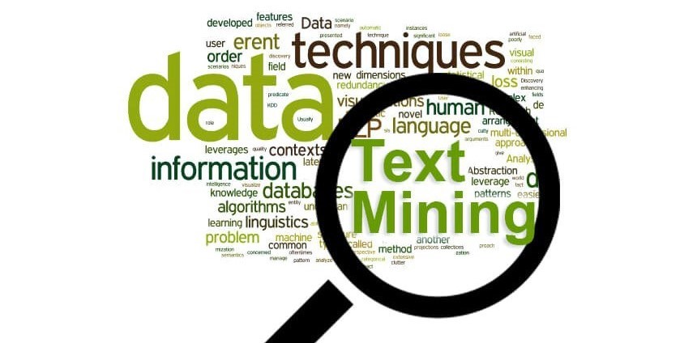
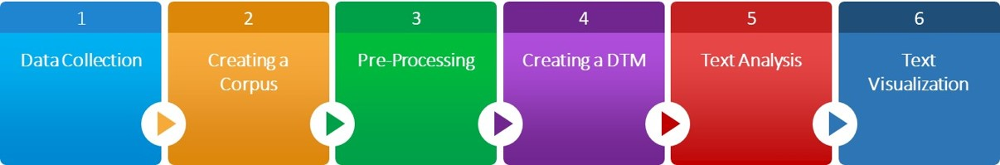
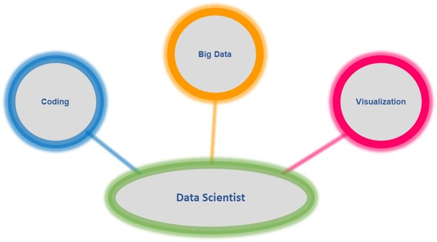

<style type="text/css">

body{ /* Normal  */
      font-size: 12px;
  }
td {  /* Table  */
  font-size: 8px;
}
h1.title {
  font-size: 38px;
  color: #228200;
}
h1 { /* Header 1 */
  font-size: 28px;
  color: #228200;
}
h2 { /* Header 2 */
    font-size: 22px;
  color: #228200;
}
h3 { /* Header 3 */
  font-size: 18px;
  font-family: "Times New Roman", Times, serif;
  color: #228200;
}
code.r{ /* Code block */
    font-size: 12px;
}
pre { /* Code block - determines code spacing between lines */
    font-size: 14px;
}

.list-group-item.active, .list-group-item.active:focus, .list-group-item.active:hover {
    background-color: #228200;
    color:white;
}

</style>


<center></center>


# Introduction
 
## Overview
In this project, we will analyze a dataset composed by job postings in order to discover useful information regarding a specific job title through various text analytics techniques. 
The job title and the location associated with it, used to gather the job posting descriptions, were Data Scientist and Los Angeles respectively. All job postings were filtered by date: January 2019.
Techniques used were tokenization, stemming, lemmatization, n-gram, and so on.


## Purpose
The main purpose of this project is to gain insights that can help job applicants to be familiar with what the organizations are looking for in terms of data scientist positions located in Los Angeles area.

## High level approach


<center></center>


# Data Collection

## Library import
Loading libraries for this project life cycle: **data cleaning, processing & visualization...**

```{r setting, eval=TRUE, warning = FALSE, message=FALSE}

# There are a range of packages in R for doing text analysis. These include:
# 
# hunspell - Tools for spelling, stemming, and tokenization.
# SnowballC - Tools for stemming in a range of languages.
# stringr - Tools for cleaning individual strings (e.g. trimming whitespace).
# text2vec - Tools for tools for text vectorization, topic modeling, and more.
# tidytext - Tools for word processing, sentiment analysis, and tidying text.
# tm - A framework for text mining.
Sys.setenv(JAVA_HOME='C:\\Program Files (x86)\\Java\\jre1.8.0_45') # for 32-bit version

library(tm)
library(tmap)
library(SnowballC)
library(ggplot2)
library(DT)
library(plyr)
library(tibble)
library(RColorBrewer)
library(wordcloud)
library(stringr)
library(textstem)
library(RWeka)
library(qdap)
library(RColorBrewer)
library(udpipe)
library(lattice)
library(filematrix)

```


## Data Loading
Loading  **Job posting dataset...**
```{r loading2, eval=TRUE , warning = FALSE, message=FALSE}

# Setting my working directory in R
setwd("C:/Saul/Portfolio/Text Analytics") 
# Reading the dataset

data.text  <- read.csv("DataScientistjobs.csv")  
data.tools  <- read.csv("Tools.csv") 

#yy <- matrix(t(as.matrix(as.data.frame(t(data.tools)))), nrow = 1)

```

## Data Exploring
```{r exploring, eval=TRUE , warning = TRUE, message=FALSE}

#  Data structure review
#  str(data.text)
#  Data preview

```
Checking a **sample data...**
```{r exploring0, fig.height=6, fig.cap ="" , eval=TRUE , warning = FALSE, message=FALSE}

datatable(data.text[(1:20),], filter = 'top', options = list(
  pageLength = 5, scrollX = TRUE, scrollY = "300px", autoWidth = TRUE))

```

# Creating a Corpus

## Corpus Preparation
The next step is to transform the dataset into a text document **using the function Corpus** that belongs to the **TM package**.
Corpus is a function that takes a text document as input and returns a text document (a character vector).
[Read more about TM.](https://cran.r-project.org/web/packages/tm/tm.pdf){target="_blank"}

```{r preparation, eval=TRUE , warning = FALSE, message=FALSE}

# Create corpus
corpus = Corpus(VectorSource(data.text$Description))
# Look at corpus
print(corpus)

```

# Pre-Processing
Once we have a corpus, then we need to modify the documents in it, e.g., **puntuaction removal, stemming, stopword removal,*** etcetera.

```{r pre-processing, eval=TRUE , warning = FALSE, message=FALSE}

cleanCorpus <- function(corpus){
  # Converting to lower-case
  corpus.cleaned <- tm_map(corpus, tolower)
  # Removing punctuation
  corpus.cleaned <- tm_map(corpus.cleaned, removePunctuation)
  # Looking at stop words 
  v_stopwords <- c(stopwords("en"),"will","etc","build","using","usemploymentcompliancecgicom","unless","vary","reason","routed","recruited")
  corpus.cleaned <- tm_map(corpus.cleaned, removeWords,v_stopwords )
  #Eliminating extra whitespace
  corpus.cleaned <- tm_map(corpus.cleaned, stripWhitespace)
  #Removing numbers
  corpus.cleaned <- tm_map(corpus.cleaned, removeNumbers)
  #Stemming/Lemmatizing document 
  #corpus.cleaned <- tm_map(corpus.cleaned, lemmatize_strings,v_stopwords)
  #Removing special characters 
  corpus.cleaned <- tm_map(corpus.cleaned, str_replace_all,"[^[:alnum:]]", " ")
  #corpus[[1]]$content
  return(corpus.cleaned)
}
corpus <- cleanCorpus(corpus)


```

# Creating a TDM
Now let's create a ***Term Document Matrix (TDM).*** A term-document matrix is a mathematical matrix that describes the frequency of terms that occur in a collection of documents.
[This video concisely explains what TDM is.](https://www.youtube.com/watch?v=dE10fBCDWQc){target="_blank"} 

## Convert corpus into TDM
Also, let's **inspect** 10 terms that belong to 10 documents.

```{r tdm, eval=TRUE , warning = FALSE, message=FALSE}

#convert to document term matrix
corpustdm <- TermDocumentMatrix(corpus)
#print(corpustdm) 
#print(dimnames(corpustdm)$Terms)
#dim(corpustdm)
inspect(corpustdm[1:10,1:10])

```

# Text Analysis

##Frequency words
Checking the **number of terms**.
```{r textanalysis1, eval=TRUE , warning = FALSE, message=FALSE}

#collapse matrix by summing over columns
set.seed(43)
colS <- colSums(as.matrix(t(corpustdm)))

#total number of terms
length(colS)
# create sort order (asc)
ord <- order(colS,decreasing=TRUE)

```

Inspecting **most frequently** ocurring terms.

```{r textanalysis12, eval=TRUE , warning = FALSE, message=FALSE}

colS[head(ord)]

```

Inspecting **least frequently** ocurring terms.

```{r textanalysis3, eval=TRUE , warning = FALSE, message=FALSE}

colS[tail(ord)]

```

Listing terms that appear **at least 50 times**.

```{r textanalysis4, eval=TRUE , warning = FALSE, message=FALSE}

findFreqTerms(corpustdm, lowfreq=50)

```

Let's take some of the above terms and check if there is a **correlation** with other terms having a correlation coefficient of **at least 70%**.

```{r textanalysis5, eval=TRUE , warning = FALSE, message=FALSE}

findAssocs(corpustdm, "analysis",0.7)
findAssocs(corpustdm, "degree",0.7)


```
# Text Visualization

##Histogram
```{r textvisualization1, eval=TRUE , warning = FALSE, message=FALSE}


m <- as.matrix(corpustdm)
corpusdf <- data.frame(m)

v <- sort(rowSums(m),decreasing=TRUE)
d <- data.frame(word = names(v),freq=v)

corpusdf <- rownames_to_column(corpusdf)
corpusdf <- rename(corpusdf, c("rowname"="word"))
corpusdf$wordcount <- rowSums(corpusdf[-1])
corpusdf <- corpusdf[order(-corpusdf$wordcount),]


#plotting histogram
ggplot(subset(corpusdf, wordcount>43), aes(reorder(word, -wordcount), wordcount)) +
   geom_bar(stat = "identity", fill = "darkgreen", alpha = 0.7) +
  xlab("Words with the highest frequency") +
  ylab("Frequency") +
  ggtitle("Understanding word frequencies") +
  theme_bw() +
  theme(axis.text.x=element_text(angle=60, hjust=0.9), plot.title = element_text(hjust=0.5)) +
 scale_fill_brewer() 


```

## Top 10 words
```{r textvisualization2, eval=TRUE , warning = FALSE, message=FALSE}

pal <- colorRampPalette(colors = c("darkgreen", "lightgreen"))(10)

barplot(d[1:10,]$freq, las = 2, names.arg = d[1:10,]$word,
         main ="Top 10 Most Frequent Words",
        ylab = "Frequency", col = pal,  border = NA)


```

## WordClouds
```{r textvisualization3, eval=TRUE , warning = FALSE, message=FALSE}

# wordcloud(names(colS), colS, colors = brewer.pal(6, 'Dark2'),random.order=FALSE, rot.per= 0.35, max.words = 100)


#since all the rows are same and numeric,we can add them up to get the total value
#sort it based on the number

pal <- brewer.pal(9,"RdYlGn")
pal <- pal[-(1:2)]

set.seed(142)
wordcloud(word=corpusdf$word, freq= corpusdf$wordcount,  colors = brewer.pal(6, "Dark2"), random.order=FALSE, rot.per= 0.35, max.words = 150)


```

## Universal Word Classes {.tabset}

### Universal Parts of Speech
```{r textvisualization4, eval=TRUE , warning = FALSE, message=FALSE}


#ud_model <- udpipe_download_model(language = "english")
#ud_model <- udpipe_load_model(ud_model$file_model)
ud_model <- udpipe_load_model(file = "english-ewt-ud-2.3-181115.udpipe")


x <- udpipe_annotate(ud_model, x = data.text$Description, doc_id = data.text$Company)
x <- as.data.frame(x)


stats <- txt_freq(x$upos)
stats$key <- factor(stats$key, levels = rev(stats$key))
barchart(key ~ freq, data = stats, col = "lightgreen", 
         main = "UPOS (Universal Parts of Speech)\n frequency of occurrence", 
         xlab = "Freq")


```

### Adjectives
```{r textvisualization5, eval=TRUE , warning = FALSE, message=FALSE}

## ADJECTIVES
stats <- subset(x, upos %in% c("ADJ")) 
stats <- txt_freq(stats$token)
stats$key <- factor(stats$key, levels = rev(stats$key))
barchart(key ~ freq, data = head(stats, 20), col = "purple", 
         main = "Most occurring adjectives", xlab = "Freq")

```

### Nouns
```{r textvisualization6, eval=TRUE , warning = FALSE, message=FALSE}


## NOUNS
stats <- subset(x, upos %in% c("VERB")) 
stats <- txt_freq(stats$token)
stats$key <- factor(stats$key, levels = rev(stats$key))
barchart(key ~ freq, data = head(stats, 20), col = "gold", 
         main = "Most occurring Verbs", xlab = "Freq")

```

## RAKE chart

Rapid Automatic Keyword Extraction **(RAKE)** is an algorithm to automatically extract keywords from documents. 
[More info here.](https://www.thinkinfi.com/2018/09/keyword-extraction-using-rake-in-python.html){target="_blank"} 

```{r textvisualization7, eval=TRUE , warning = FALSE, message=FALSE}

## Using RAKE
#Rapid Automatic Keyword Extraction (RAKE) is an algorithm to automatically extract keywords from documents.
#More info on https://www.thinkinfi.com/2018/09/keyword-extraction-using-rake-in-python.html

stats <- keywords_rake(x = x, term = "lemma", group = "doc_id", 
                       relevant = x$upos %in% c("NOUN", "ADJ"))
stats$key <- factor(stats$keyword, levels = rev(stats$keyword))
barchart(key ~ rake, data = head(subset(stats, freq > 3), 20), col = "red", 
         main = "Keywords identified by RAKE", 
         xlab = "Rake")


# ## Using a sequence of POS tags (noun phrases / verb phrases)
# x$phrase_tag <- as_phrasemachine(x$upos, type = "upos")
# stats <- keywords_phrases(x = x$phrase_tag, term = tolower(x$token), 
#                           pattern = "(A|N)*N(P+D*(A|N)*N)*", 
#                           is_regex = TRUE, detailed = FALSE)
# stats <- subset(stats, ngram > 1 & freq > 3)
# stats$key <- factor(stats$keyword, levels = rev(stats$keyword))
# barchart(key ~ freq, data = head(stats, 20), col = "magenta", 
#          main = "Keywords - simple noun phrases", xlab = "Frequency")
# 


```

## N-gram charts

```{r textvisualization8, eval=TRUE , warning = FALSE, message=FALSE}


library(dplyr) 
library(tidytext)

# Define bigram & trigram tokenizer 
tokenizer_bi <- function(x){
  NGramTokenizer(x, Weka_control(min=2, max=2))
}

tokenizer_tri <- function(x){
  NGramTokenizer(x, Weka_control(min=3, max=3))
}


# Text transformations
cleanVCorpus <- function(corpus){
  corpus.tmp <- tm_map(corpus, removePunctuation)
  corpus.tmp <- tm_map(corpus.tmp, stripWhitespace)
  corpus.tmp <- tm_map(corpus.tmp, content_transformer(tolower))
  v_stopwords <- c(stopwords("en"),"will","etc","build","using")
  corpus.tmp <- tm_map(corpus.tmp, removeWords, v_stopwords)
  corpus.tmp <- tm_map(corpus.tmp, removeNumbers)
  return(corpus.tmp)
}

# Most frequent bigrams 
frequentBigrams <- function(text){
  s.cor <- VCorpus(VectorSource(text))
  s.cor.cl <- cleanVCorpus(s.cor)
  s.tdm <- TermDocumentMatrix(s.cor.cl, control=list(tokenize=tokenizer_bi))
  s.tdm <- removeSparseTerms(s.tdm, 0.999)
  m <- as.matrix(s.tdm)
  word_freqs <- sort(rowSums(m), decreasing=TRUE)
  dm <- data.frame(word=names(word_freqs), freq=word_freqs)
  return(dm)
}


# Most frequent bigrams
ep4.bigrams <- frequentBigrams(data.text$Description)[1:20,]
ggplot(data=ep4.bigrams, aes(x=reorder(word, -freq), y=freq)) +  
  geom_bar(stat="identity", fill="chocolate2", colour="black") +
  theme_bw() +
  theme(axis.text.x=element_text(angle=60, hjust=1)) +
  labs(x="Bigram", y="Frequency")

# Most frequent trigrams 
frequentTrigrams <- function(text){
  s.cor <- VCorpus(VectorSource(text))
  s.cor.cl <- cleanVCorpus(s.cor)
  s.tdm <- TermDocumentMatrix(s.cor.cl, control=list(tokenize=tokenizer_tri))
  s.tdm <- removeSparseTerms(s.tdm, 0.999)
  m <- as.matrix(s.tdm)
  word_freqs <- sort(rowSums(m), decreasing=TRUE)
  dm <- data.frame(word=names(word_freqs), freq=word_freqs)
  return(dm)
}

# Most frequent trigrams
ep4.Trigrams <- frequentTrigrams(data.text$Description)[1:20,]
ggplot(data=ep4.Trigrams, aes(x=reorder(word, -freq), y=freq)) +  
  geom_bar(stat="identity", fill="midnightblue", colour="black") +
  theme_bw() +
  theme(axis.text.x=element_text(angle=60, hjust=1)) +
  labs(x="Trigram", y="Frequency")


```

## Key Data Science Tools

```{r output1, eval=TRUE , warning = FALSE, message=FALSE}

uniqueWords = function(text) {
text <- strsplit(text, " |,|/|;")
text <- lapply(text,unique)
text <- sapply(text, function(u) paste0(u, collapse = " "))
return(text) 
}

corpus = tm_map(corpus, content_transformer(uniqueWords))
corpustdm_all <- as.matrix(TermDocumentMatrix(corpus,control=list(wordLengths=c(1,Inf))))

freq <- rowSums(as.matrix(corpustdm_all))
#freq[ as.character(tolower(data.tools[,])) ]

m <- as.matrix(freq[ as.character(tolower(data.tools[,])) ])
n <- as.data.frame(rownames(m))
colnames(n) <- c("toolname")
n$frequency <- round(as.numeric(as.character(m[,1]))/ncol(corpustdm_all),2)
n <- na.omit(n)
#n <- subset(n,frequency>0.1)
n <- head(n[order(n$frequency, decreasing= T),], n = 20)

mycolors = colorRampPalette(brewer.pal(name="Blues", n = 12))(20)
#mycolors = c(brewer.pal(name="Dark2", n = 8), brewer.pal(name="Paired", n = 7))

ggplot(data=n, aes(x= reorder(n$toolname,-frequency), y=n$frequency, fill = n$toolname)) +
  geom_bar(stat="identity")+
  scale_y_continuous(labels = scales::percent) +
  geom_text(aes(label = paste0(frequency*100,"%")), 
  position = position_stack(vjust = 0.5), size = 3) +
  scale_color_manual(values = mycolors) +
  theme(legend.position="none") +
  labs(x = "Tools", y = "Percent") +
  ggtitle("Top 20 Tools in Data Scientist Job Listings") + 
  theme(plot.title = element_text(hjust=0.5)) +
  ggpubr::rotate_x_text()


```

# Results

##Findings

Although is very well known that **coding** and **visualization** tools knowledge are fundamental to supports data scientists in their performance of tasks, results demonstrates that **Big Data tools** are gaining ground for virtually every data scientist position. Therefore, Big Data is **not anymore** only associated to **Data Engineers roles exclusively**.

<center></center>
```{r results1, eval=TRUE , warning = FALSE, message=FALSE }

# 5.3 Plot the model


```

##Suggestions

```{r labeling3, eval=TRUE , warning = FALSE, message=FALSE }
# test

```

#What is Next

+ **<span style="color:black">Incoporate an API to retrieve job postings automatically.</span>**
+ **<span style="color:black">Use geographic visualization to show insigths based on locations.</span>**
+ **<span style="color:black">Predict salaries by using job post data.</span>**


```{r next, eval=TRUE , warning = FALSE, message=FALSE }


```


